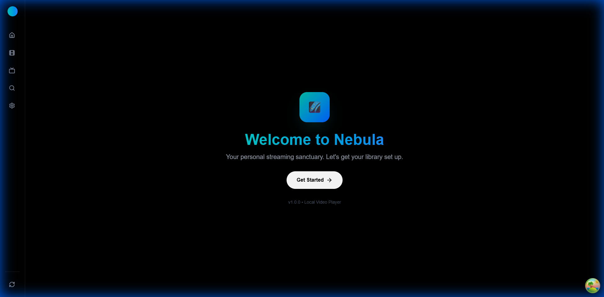
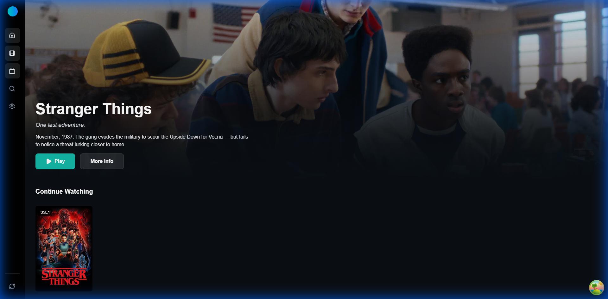
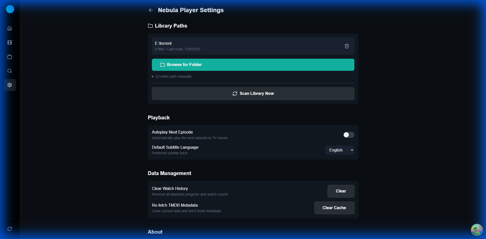

# Nebula Player 🌌

A beautiful local video streaming player with a Netflix-style interface. Stream your local video library in the browser with automatic metadata fetching from TMDB.


---

## ✨ Features

- 🎬 **Netflix-style UI** - Beautiful teal-themed dark interface
- 📂 **Library Management** - Add multiple folders to your library
- 🔍 **TMDB Integration** - Automatic movie/TV show metadata and posters
- ▶️ **Video Playback** - Native HTML5 video player with keyboard shortcuts
- 🔄 **FFmpeg Transcoding** - Plays incompatible formats (HEVC, etc.) via real-time transcoding
- 📊 **Continue Watching** - Resume videos where you left off
- 🎯 **Smart Filtering** - Only shows videos from configured library paths
- 🧪 **E2E Testing** - Comprehensive Playwright test suite

---

## 📸 Screenshots

### Welcome & Onboarding
Add your media folders to get started with Nebula Player.



### Home - Media Library
Browse your entire video collection with beautiful poster artwork.



### Settings & Library Management
Manage your media folders, scan for new content, and configure preferences.



---

## 🚀 Quick Start

### Prerequisites

- [Node.js](https://nodejs.org/) 18+
- [FFmpeg](https://ffmpeg.org/) (optional, for transcoding)
- [TMDB API Key](https://www.themoviedb.org/settings/api) (optional, for metadata)

### Installation

```bash
# Clone the repository
git clone <repo-url>
cd nebula-player

# Backend setup
cd backend
npm install
cp .env.example .env  # Edit with your TMDB API key
npm run dev

# Frontend setup (new terminal)
cd frontend
npm install
npm run dev
```

### Access

Open **http://localhost:5173** in your browser.

---

## 📖 User Onboarding Guide

### Step 1: Add Your Media Folders

When you first open Nebula Player, you'll see the **Welcome Page**:

1. Click **"Browse Folders"** to navigate your filesystem
2. Select folders containing your movies or TV shows
3. Toggle **"Recursive Scanning"** to include subfolders
4. Click **"Add Path"** to add the folder

### Step 2: Scan Your Library

Once folders are added:

1. Navigate to **Settings** (gear icon in sidebar)
2. Click **"Scan Library Now"** to discover all video files
3. Wait for the scan to complete

### Step 3: Enjoy Your Content

- **Home Page**: Browse all your media with poster artwork
- **Search**: Find specific titles or filter by genre/year
- **Playback**: Click any title to watch with full player controls
- **Continue Watching**: Resume where you left off

---

## ⌨️ Keyboard Shortcuts

| Key | Action |
|-----|--------|
| `Space` / `K` | Play/Pause |
| `←` / `→` | Seek -10s / +10s |
| `↑` / `↓` | Volume up/down |
| `F` | Fullscreen |
| `M` | Mute |
| `Esc` | Close player |

---

## 🧪 Testing

Nebula Player includes a comprehensive E2E test suite using Playwright:

```bash
cd frontend

# Run all E2E tests
npm run test:e2e

# Run with interactive UI
npm run test:e2e:ui

# Run with visible browser
npm run test:e2e:headed
```

**Test Coverage:**
- Welcome/Onboarding flow (5 tests)
- Home page & navigation (5 tests)
- Search & filtering (5 tests)
- Media detail page (5 tests)
- Settings management (6 tests)

---

## 📁 Project Structure

```
nebula-player/
├── backend/           # Express.js API server
│   ├── src/
│   │   ├── routes/    # API routes (media, video, playback, settings)
│   │   ├── scanner/   # File scanner & metadata extractor
│   │   ├── services/  # TMDB integration, transcoding
│   │   └── db.ts      # SQLite database
│   └── package.json
├── frontend/          # React + Vite frontend
│   ├── src/
│   │   ├── pages/     # Home, Detail, Player, Settings, Search
│   │   ├── components/# MediaGrid, VideoPlayer, etc.
│   │   ├── hooks/     # Custom React hooks
│   │   └── api/       # API client
│   ├── e2e/           # Playwright E2E tests
│   └── package.json
├── docs/
│   └── screenshots/   # App screenshots
└── README.md
```

---

## ⚙️ Configuration

### Environment Variables (`backend/.env`)

```env
# TMDB API (optional - for movie/TV metadata)
TMDB_API_KEY=your_api_key_here
TMDB_ACCESS_TOKEN=your_access_token_here

# Server
PORT=3001
FRONTEND_URL=http://localhost:5173

# Database
DB_PATH=./database.sqlite
```

---

## 🎥 Supported Video Formats

**Direct Playback (no transcoding):**
- MP4 (H.264/AAC)
- WebM (VP8/VP9)

**Transcoded Playback (requires FFmpeg):**
- MKV, AVI, MOV
- HEVC/H.265
- DTS/AC3 audio

---

## 🛠️ Tech Stack

**Backend:**
- Express.js
- better-sqlite3
- FFmpeg (transcoding)
- TMDB API

**Frontend:**
- React 19
- Vite 7
- Tailwind CSS 4
- React Router 7
- TanStack Query

**Testing:**
- Playwright

---

## 📄 License

MIT

---

Built with ❤️ using React, Express, and FFmpeg
